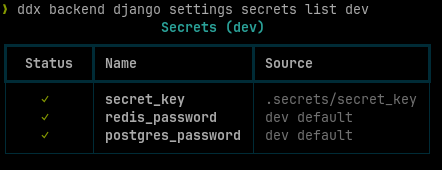
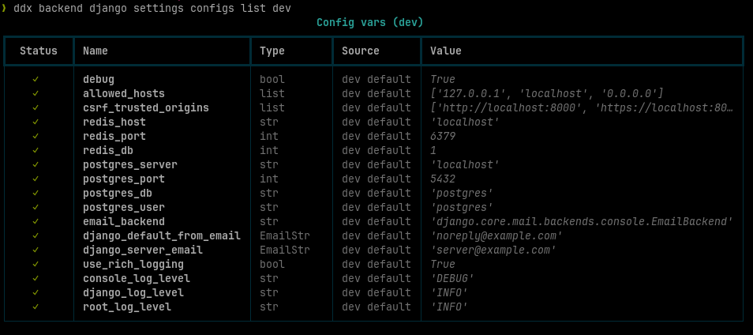

# Managing Settings

Generated Django projects use `pydantic-settings` for all configuration.

## How Settings Are Organized

| Directory            | Purpose                               |
| -------------------- | ------------------------------------- |
| `settings/django/`   | Core Django settings (always present) |
| `settings/packages/` | Settings added by installed packages  |
| `settings/apps/`     | Your own app settings                 |

Each package that needs configuration adds its own settings file under
`settings/packages/` — for example, PostgreSQL adds `database.py` with
`postgres_server`, `postgres_port`, `postgres_db`, `postgres_user`, and
`postgres_password`. Each file declares its own `AppBaseSettings` subclass.

When you add your own file to `settings/apps/`, everything shows up in the
`list` commands below — no manual registration needed.

## Managing Settings with the CLI

The `ddx backend django settings` command tree provides tools to inspect,
verify, and initialize configuration and secrets.

### Secrets

Secrets are sensitive values -- passwords, API keys, and signing keys. They
are stored in `.secrets/<field_name>` and should never be committed.

```bash
# Initialize secrets for local development — auto-generates where possible,
# prompts for the rest, writes to .secrets/<name>
ddx backend django settings secrets init dev

# Initialize secrets for production — same but writes to .secrets.prod/<name>
ddx backend django settings secrets init prod

# Show all secrets with their resolve source and value
ddx backend django settings secrets list dev
ddx backend django settings secrets list prod

# Verify all secrets are present — exits with code 1 if anything is missing
ddx backend django settings secrets verify dev
ddx backend django settings secrets verify prod
```

Example output after installing PostgreSQL and Redis:



### Config Vars

Config vars are non-sensitive settings -- hostnames, ports, and toggles. They
can be set via `.env`, environment variables, or default values in settings.

```bash
# Initialize production config vars — prompts for each missing var,
# validates input against pydantic type annotations, writes to .env.prod.
# Supports readline history (up/down arrows) and line editing.
ddx backend django settings configs init prod

# Show all config vars with their resolve source and value
ddx backend django settings configs list dev
ddx backend django settings configs list prod

# Verify all config vars are present — exits with code 1 if anything is missing
ddx backend django settings configs verify dev
ddx backend django settings configs verify prod
```

Example output after installing PostgreSQL, Redis:



These commands scan all three settings directories (`django/`, `packages/`,
`apps/`) and show everything in one view.

## Onboarding a New Developer

After cloning a generated project, run these commands to get secrets and
config vars ready for local development:

```bash
cd myproject
ddx backend django settings secrets init dev
ddx backend django settings secrets verify dev
ddx backend django settings configs verify dev
```

## Adding Settings for Your Own Apps

When you create your own Django app, you should follow the same
`AppBaseSettings` pattern to add its configuration.

### Where Settings Live

Settings files go in the `settings/apps/` directory -- one file per app.

Every `.py` file under `settings/apps/` is automatically discovered and
executed by `settings/__init__.py`. No manual registration needed.

### 1. Create Your App

Run `ddx backend django create app`. This creates your app under `backend/`
and generates a settings file at `settings/apps/<app_name>.py` that registers
it in `INSTALLED_APPS`. You can then add your `AppBaseSettings` subclass to
that file.

### 2. Subclass AppBaseSettings

```python
from typing import Any

from pydantic import SecretStr

from settings.utils.base_settings import AppBaseSettings


class MyAppSettings(AppBaseSettings):
    api_key: SecretStr
    api_timeout: int = 30
    api_endpoint: str = "https://api.example.com"
```

- `SecretStr` fields are treated as **secrets** (stored in `.secrets/`)
- Plain fields (`str`, `int`, `bool`, `list`) are treated as **config vars**
- Field-level defaults (like `= 30`) are the lowest-priority fallback

### 3. Provide Dev Defaults

Override `get_dev_defaults()` so the app works without any `.env` file:

```python
    @classmethod
    def get_dev_defaults(cls) -> dict[str, Any]:
        return {
            "api_endpoint": "http://localhost:8000",
            "api_timeout": 5,
        }
```

### 4. Use the Settings

Instantiate at module level, unwrap `SecretStr` values with
`.get_secret_value()`, and assign to module-level variables:

```python
_settings = MyAppSettings()

API_KEY: str = _settings.api_key.get_secret_value()
API_TIMEOUT: int = _settings.api_timeout
API_ENDPOINT: str = _settings.api_endpoint
```

### Devcontainer Overrides

If your app needs different hostnames inside a devcontainer, override
`get_devcontainer_overrides()`:

```python
    @classmethod
    def get_devcontainer_overrides(cls) -> dict[str, Any]:
        return {
            "api_endpoint": "http://web:8000",
        }
```

These are merged on top of `get_dev_defaults()` when `DEVCONTAINER=true`.

### Full Example

Here is a complete `settings/apps/myapp.py`:

```python
from typing import Any

from pydantic import SecretStr

from settings.utils.base_settings import AppBaseSettings


class MyAppSettings(AppBaseSettings):
    api_key: SecretStr
    api_timeout: int = 30
    api_endpoint: str = "https://api.example.com"

    @classmethod
    def get_dev_defaults(cls) -> dict[str, Any]:
        return {
            "api_endpoint": "http://localhost:8000",
            "api_timeout": 5,
        }

    @classmethod
    def get_devcontainer_overrides(cls) -> dict[str, Any]:
        return {
            "api_endpoint": "http://web:8000",
        }


_settings = MyAppSettings()

API_KEY: str = _settings.api_key.get_secret_value()
API_TIMEOUT: int = _settings.api_timeout
API_ENDPOINT: str = _settings.api_endpoint
```

### Providing Config and Secrets

When you add a `SecretStr` field to your settings class, the behavior during
`secrets init` depends on whether a dev default exists:

- **Dev default defined** -- `ddx backend django settings secrets init dev`
  skips the field silently (no prompt)
- **No dev default** -- you will be prompted interactively (hidden input,
  must confirm by typing twice)

`configs init prod` enables readline before prompting, so you get command
history (up/down arrows recall previous values) and full line editing
(left/right, home/end, delete). History is saved to `~/.djdevx/readline_history`.

In production (`ddx backend django settings secrets init prod`), dev defaults
are not used. Every secret must be provided or you will be prompted. Run
`ddx backend django settings secrets verify` to check -- it exits with code 1
if anything is missing.

`ddx backend django settings secrets init prod` creates `.secrets.prod/` and
`ddx backend django settings configs init prod` creates `.env.prod`, so you
can see exactly what variables a production deployment needs. In a real
Kubernetes deployment, create one Secret per file in `.secrets.prod/` and a
ConfigMap from `.env.prod`:

```bash
kubectl create secret generic api-key --from-file=.secrets.prod/api_key
kubectl create secret generic postgres-password --from-file=.secrets.prod/postgres_password
kubectl create secret generic redis-password --from-file=.secrets.prod/redis_password
kubectl create secret generic secret-key --from-file=.secrets.prod/secret_key
```

```bash
kubectl create configmap app-config --from-env-file=.env.prod
```

Then mount each into your deployment:

```yaml
spec:
  containers:
    - name: app
      volumeMounts:
        - name: api-key
          mountPath: /run/secrets/api_key
          subPath: api_key
        - name: postgres-password
          mountPath: /run/secrets/postgres_password
          subPath: postgres_password
        - name: redis-password
          mountPath: /run/secrets/redis_password
          subPath: redis_password
        - name: secret-key
          mountPath: /run/secrets/secret_key
          subPath: secret_key
        - name: app-config
          mountPath: /run/configs/app-config
  volumes:
    - name: api-key
      secret:
        secretName: api-key
    - name: postgres-password
      secret:
        secretName: postgres-password
    - name: redis-password
      secret:
        secretName: redis-password
    - name: secret-key
      secret:
        secretName: secret-key
    - name: app-config
      configMap:
        name: app-config
```

*Kubernetes is just one example — the `.secrets.prod/` and `.env.prod` files
work with any deployment method (Docker Compose, Nomad, manual provisioning,
etc.).*

## Deep Dive

For the architecture behind settings — source priority, dev vs prod mode,
class-based defaults, and the `SettingCollector` — see
[Pydantic Settings](../developer-guide/pydantic-settings.md).
